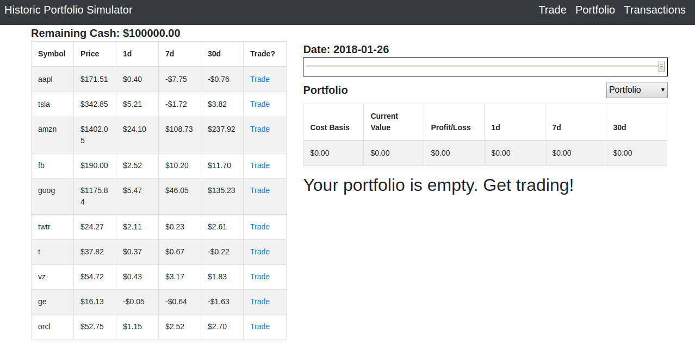
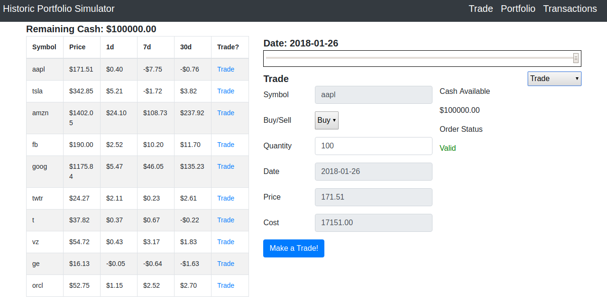
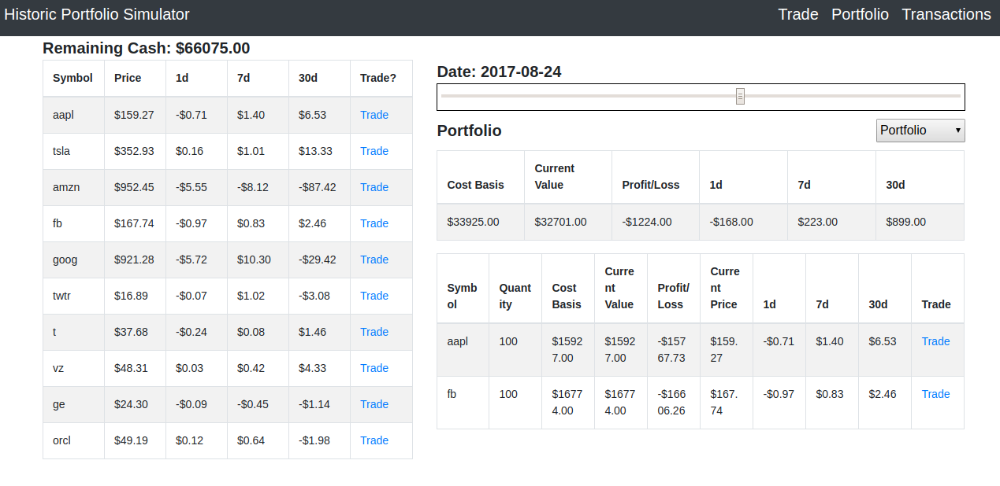

# Historic Stock Portfolio
Buy and Sell stocks throughout the past year. With time travel! Use this project live on [Heroku](https://historic-stock-portfolio.herokuapp.com).

The Historic Stock Portfolio is a [React](https://reactjs.org/)/[Redux](https://redux.js.org/) single page application (SPA) that uses [React Router](https://github.com/ReactTraining/react-router) and is served from an [Express.js](https://expressjs.com/) server running in a [Node.js](https://nodejs.org/) environment. 
Historic stock data is gathered from the [Quandl API](https://www.quandl.com/).

You can buy and sell stocks from the trade page. Adjust the slider to change the current date. Feel free to buy stocks at their
low point, then time travel and sell at their highest! Your Portfolio will keep track of your investments as you move forward and backwards, as well as your cost basis and current profit/loss.
To look back on your amazingly farsighted decisions, click the link or selector to view your previous Transactions.
Stock prices are shown along with their performance over the past day, past 7 days, and past 30 days.
Just don't refresh the page or navigate away. None of your data will be saved and all your time traveling will be for nought.

To run this project locally, you'll need to have [Node.js](https://nodejs.org/) and [Node Package Manager](https://www.npmjs.com/) installed. You'll also need an API key from [Quandl](https://docs.quandl.com/docs#section-authentication). Save a .env file in the server directory with the text "api_key=" followed by your API key.

Once your setup is complete, run "npm install" in the directory's server terminal to install server dependencies. Then run "npm run start" to boot up your server.
While the server is running, open up the client directory in your terminal. Run "npm install". When that's complete, run "npm start".
If you've made it this far, congratulations! You're done with the setup. Just navigate to "http://localhost:3000" in your browser to enjoy this amazing
time traveling stock portfolio simulator!
